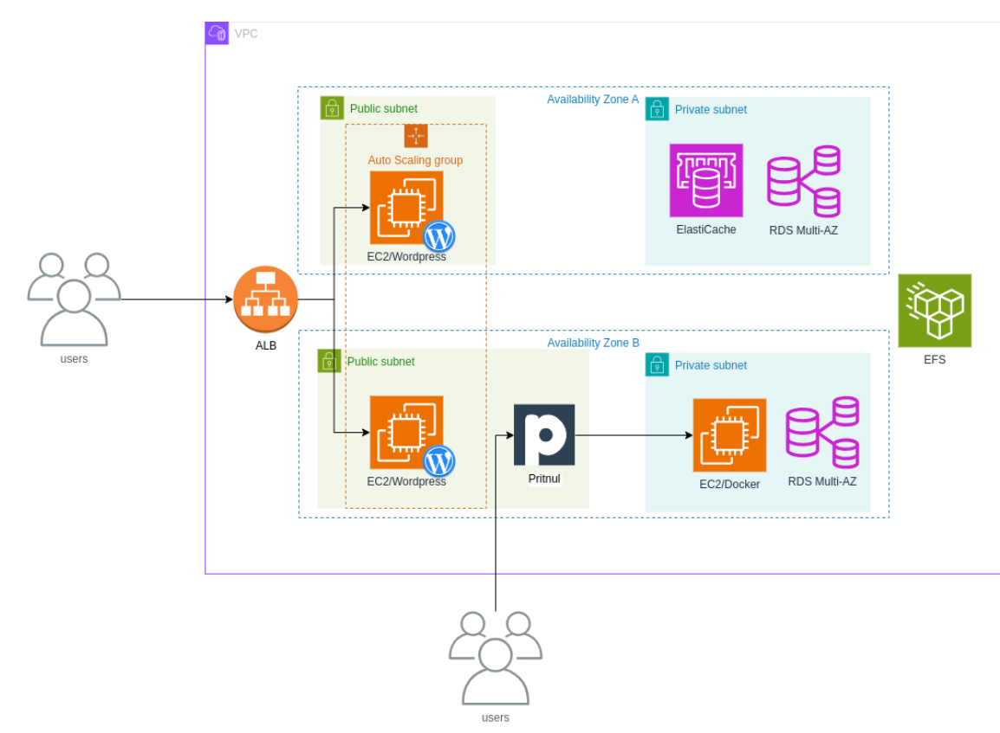

# elven




Este projeto em `terraform` tem o objetivo de criar uma infraestrutura na AWS para utilizar um site `wordpress` com alta disponibilidade e escalabilidade.\
Ele conta com banco de dados RDS, um sistema de arquivos EFS, além de um Elastic Cache para otimizar consultas.


## Requisitos

- [Conta na AWS](https://signin.aws.amazon.com/signup?request_type=register)
- [Usuário com permissões](https://docs.aws.amazon.com/pt_br/streams/latest/dev/setting-up.html)
- [Access Token CLI](https://docs.aws.amazon.com/pt_br/workmail/latest/adminguide/personal_access-token.html#)
- [Terraform](https://developer.hashicorp.com/terraform/install) ou [Opentofu](https://opentofu.org/docs/intro/install/)
- [AWS CLI](https://docs.aws.amazon.com/pt_br/cli/latest/userguide/getting-started-install.html)
- [GIT](https://git-scm.com/downloads)

Ao aplicar este projeto, será disponibilizado uma URL para acesso ao Wordpress para finalizar a instalação, necessitando apenas definir o `login` e `senha` de gerenciamento do Wordpress. 

Posteriormente será redirecionado para a página de Administração do Wordpress, para personalizar o seu site.

## Componentes

- VPC 
- - Subredes Públicas e Privadas
- - Rotas
- - Internet Gateway
- - NAT Gateway
- Grupos de Segurança
- RDS com MySQL
- Sistema de Arquivos EFS
- Grupo de Auto Scaling para Instâncias EC2
- Load Balance 
- Elastic Cache com Memcached
- Alarmes do CloudWatch

- 2 Instâncias Extras
- - Docker Privado
- - VPN Pritunl

## Como usar

Clonar este projeto:
```
git clone https://github.com/julianorib/elven.git
```

Configurar credenciais AWS: [Manual](https://docs.aws.amazon.com/pt_br/cli/v1/userguide/cli-configure-files.html)
```
aws configure
```

Criar um Bucket para salvar o `Terraform State`: [Manual](https://awscli.amazonaws.com/v2/documentation/api/latest/index.html)
```
aws s3 mb s3://seubucket
aws s3 ls
```


Definir backend remoto `environment/prod/backend.tfvars` e variáveis personalizadas `environment/prod/terraform.tfvars`.


Iniciar o Terraform / Opentofu:
```
cd elven
tofu init -backend-config=environment/prod/backend.tfvars
```

Criar uma Chave SSH:
```
ssh-keygen -t rsa
./id_rsa
```

Verificar se está tudo OK:
```
tofu validate
```

Fazer o Deploy:
```
tofu apply -var-file=environment/prod/terraform.tfvars
```

Ver outputs:
```
tofu output
tofu output -raw dbpassword
```

## Referências


https://aws.amazon.com/pt/tutorials/deploy-wordpress-with-amazon-rds/

https://aws.amazon.com/pt/getting-started/tutorials/create-network-file-system/

https://docs.pritunl.com/docs/installation

https://registry.terraform.io/providers/hashicorp/aws/latest/docs

https://aws.amazon.com/pt/elasticache/memcached/wordpress-with-memcached/

https://docs.aws.amazon.com/AmazonCloudWatch/latest/monitoring/aws-services-cloudwatch-metrics.html

