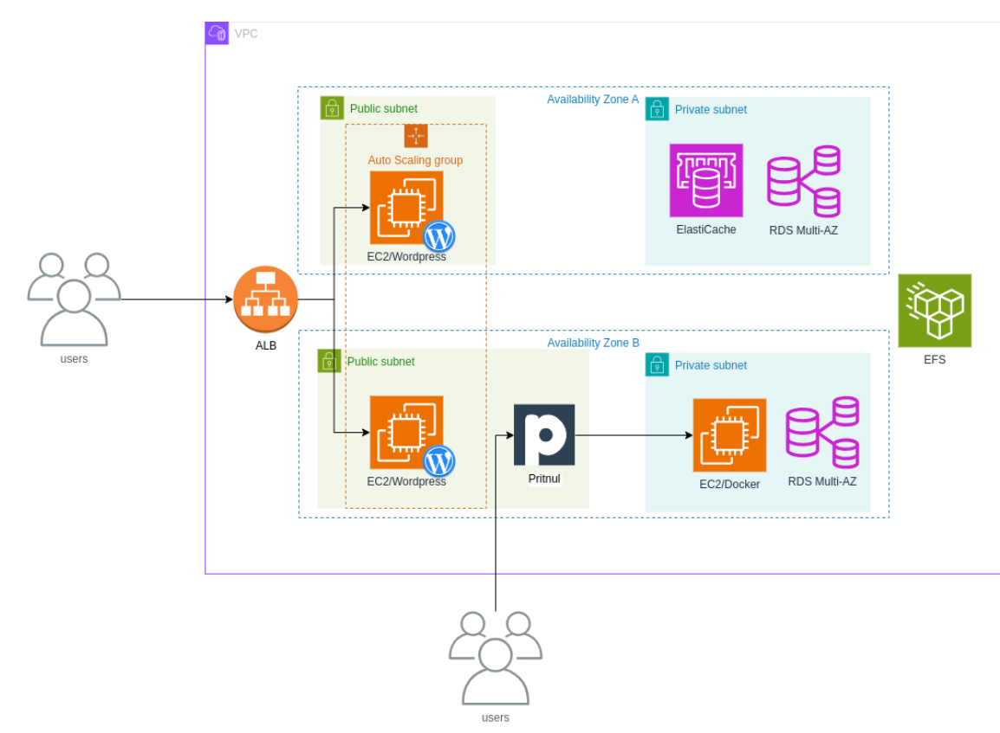
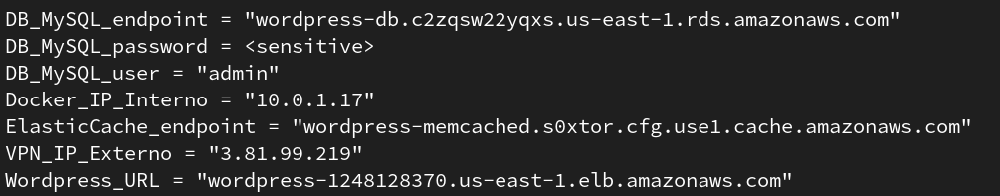
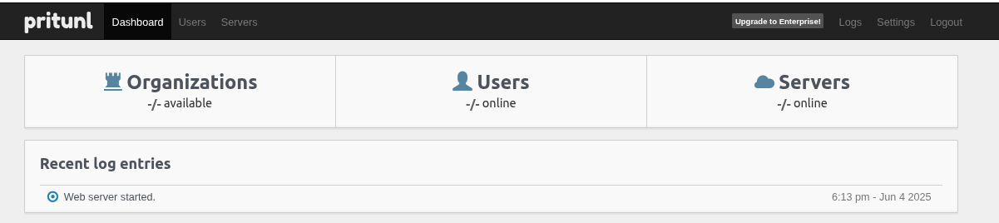
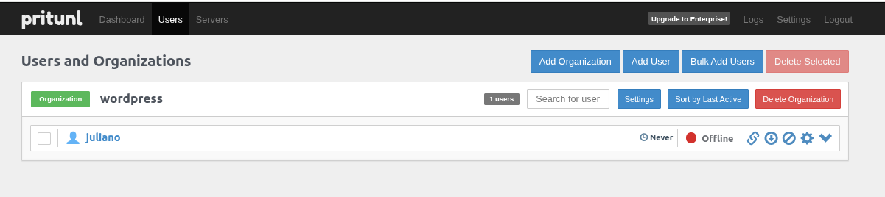
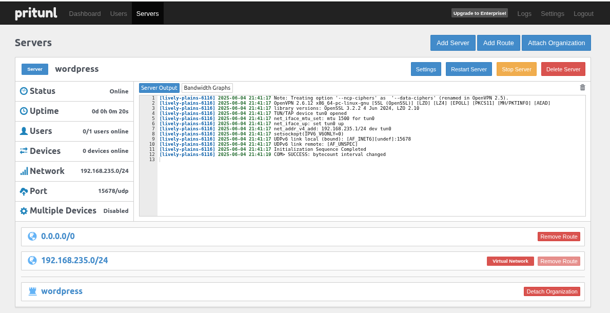
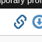
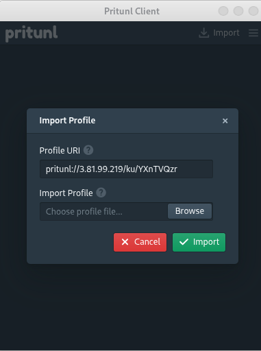
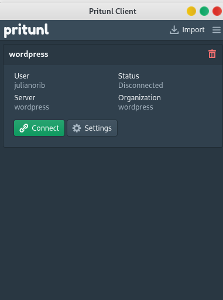

# elven




Este projeto em `terraform` tem o objetivo de criar uma infraestrutura na AWS para utilizar um site `wordpress` com alta disponibilidade e escalabilidade.\
Ele conta com banco de dados RDS, um sistema de arquivos EFS, além de um Elastic Cache para otimizar consultas.

#### Extras

Há duas instâncias para fins didáticos:
- Uma instância em subrede privada, com um Docker instalado para execução de containers.
- Uma instância de VPN que funciona como uma ponte para ter acesso aos recursos que estão em subredes privadas.


## Requisitos

- [Conta na AWS](https://signin.aws.amazon.com/signup?request_type=register)
- [Usuário com permissões](https://docs.aws.amazon.com/pt_br/streams/latest/dev/setting-up.html)
- [Access Token CLI](https://docs.aws.amazon.com/pt_br/workmail/latest/adminguide/personal_access-token.html#)
- [Terraform](https://developer.hashicorp.com/terraform/install) ou [Opentofu](https://opentofu.org/docs/intro/install/)
- [AWS CLI](https://docs.aws.amazon.com/pt_br/cli/latest/userguide/getting-started-install.html)
- [GIT](https://git-scm.com/downloads)

Ao aplicar este projeto, será disponibilizado uma URL para acesso ao Wordpress para finalizar a instalação, necessitando apenas definir o `login` e `senha` de gerenciamento do Wordpress. 

Posteriormente será redirecionado para a página de Administração do Wordpress, para personalizar o seu site.

## Componentes

- VPC 
- - Subredes Públicas e Privadas
- - Rotas
- - Internet Gateway
- - NAT Gateway
- Grupos de Segurança
- RDS com MySQL
- Sistema de Arquivos EFS
- Grupo de Auto Scaling para Instâncias EC2
- Load Balance 
- Elastic Cache com Memcached
- Alarmes do CloudWatch

- 2 Instâncias Extras
- - Docker Privado
- - VPN Pritunl

## Como usar

Clonar este projeto:
```
git clone https://github.com/julianorib/elven.git
```

Configurar credenciais AWS: [Manual](https://docs.aws.amazon.com/pt_br/cli/v1/userguide/cli-configure-files.html)
```
aws configure
```

Criar um Bucket para salvar o `Terraform State`: [Manual](https://awscli.amazonaws.com/v2/documentation/api/latest/index.html)
```
aws s3 mb s3://seubucket
aws s3 ls
```


Definir backend remoto `environment/prod/backend.tfvars` e variáveis personalizadas `environment/prod/terraform.tfvars`.


Iniciar o Terraform / Opentofu:
```
cd elven
tofu init -backend-config=environment/prod/backend.tfvars
```

Criar uma Chave SSH:
```
ssh-keygen -t rsa
./id_rsa
```

Verificar se está tudo OK:
```
tofu validate
```

Fazer o Deploy:
```
tofu apply -var-file=environment/prod/terraform.tfvars
```

Ver outputs:
```
tofu output
tofu output -raw dbpassword
```


**Copie o `Wordpress URL` e cole em seu navegador para finalizar a configuração.**


## VPN

Esta instância VPN foi criada para servir como uma Ponte (bastion) para ter acesso aos Recursos que estão nas Subnets privadas.

### Configurar o Servidor VPN

[Manual](https://docs.pritunl.com/docs/configuration-5)

1 - Acessar o endereço IP que foi exibido no output do terraform/tofu para terminar a configuração da VPN:\
Ex: `https://<ip-public>`

2 - Acessar o mesmo endereço IP por SSH. Será necessário informar a chave:\
Ex:
```
ssh -l ec2-user -i id_rsa <ip-public>
```

3 - Executar o comando no Servidor após acessado com ssh:
```
sudo pritunl setup-key
```

4 - Copie o código exibido e informe-o na página Web acessada no 1o passo e clique em Save:\
Ex: `e1d36ad30e4b48f3a91a5a2cc2024fee`

5 - Execute o comando no Servidor acessado com ssh para obter o usuário e senha administrativo:
```
sudo pritunl default-password
```

6- Faça o Login no painel administrativo (página Web):\
Ex:
```
  username: "pritunl"
  password: "n3SxptodPiau"
```
7 - Será solicitado finalizar a configuração, trocando a senha para uma de sua escolha.

8 - Dashboard da VPN:


### Criando Usuários, Organizações, Servidores

#### Será necessário criar uma Organização e um Usuário. 
- No menu superior, clique em `Users`, em seguida, clique `Add Organization` e informe um nome de sua escolha.
- No menu superior, clique em `Users`, em seguida, clique `Add User` e informe um nome de usuário de sua escolha e informe um PIN.



#### Será necessário criar um Servidor, uma Rota e associar a Organização.
- No menu superior, clique em `Servers`, em seguida, clique `Add Server` e informe um nome de sua escolha, e a Porta 15678. As demais configurações mantem no padrão.
- Será exibido as configurações do `Server`. No menu superior direito, clique em `Attach Organization`.
- Para adicionar a Rota, no menu superior direito, clique em `Add Route`, informe a Network `10.0.0.0/16`, ou a rede que desejar ter acesso no ambiente Azure (VPC / Subredes).
- Por fim, no lado esquerdo, clique em `Start Server`.



### Configurar o Client VPN

https://client.pritunl.com/

- Faça download do Pritunl VPN de acordo com o seu sistema operacional.

- Na página de administração da VPN, menu superior, clique em `Users`, em seguida no lado esquerdo do seu usuário, clique no link para obter um dos links temporários. `Copie o endereço da última opção`.


- Abra o seu Pritunl VPN Client já instalado, e no lado superior direito, clique em `Import`. Cole o endereço copiado no passo anterior na opção `Profile URl`.

  

- Por fim, clique em `Connect` e informe o PIN criado no passo 9.


## Apagar infraestrutura (Destruir tudo)

```
tofu apply -var-file=environment/prod/terraform.tfvars
```

## Referências


https://aws.amazon.com/pt/tutorials/deploy-wordpress-with-amazon-rds/

https://aws.amazon.com/pt/getting-started/tutorials/create-network-file-system/

https://docs.pritunl.com/docs/installation

https://registry.terraform.io/providers/hashicorp/aws/latest/docs

https://aws.amazon.com/pt/elasticache/memcached/wordpress-with-memcached/

https://docs.aws.amazon.com/AmazonCloudWatch/latest/monitoring/aws-services-cloudwatch-metrics.html

